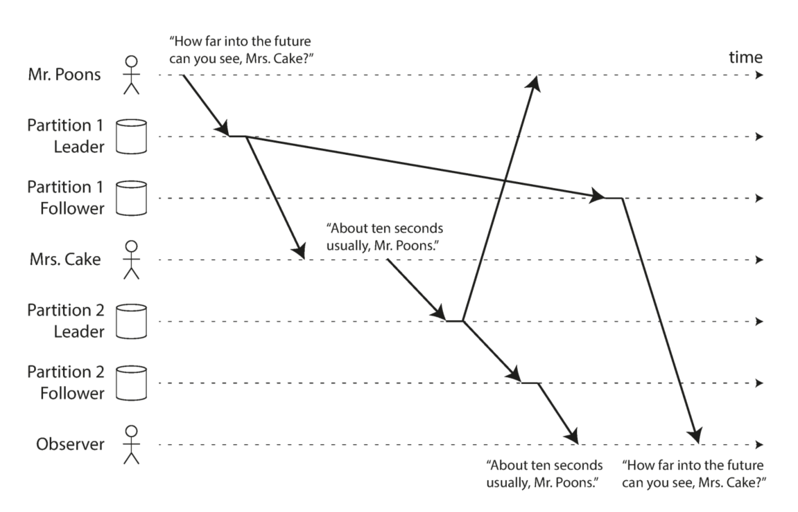

# 复制（Replication）

##  使用复制的理由与面临的问题
定义：通过互联网络，在不同的机器（machine）上保存相同的数据

几点理由：
>1. 兼顾地理位置迥异的客户，减少他们的访问**延迟（latency）**
>2. 机器互相备份，提高**可用性（availability）**
>3. 水平扩展（scale out）机器数目，提高**读吞吐率（read throughput）**（注：实现强一致性（strong consistency)时，并不能提高读吞吐率）

面临的问题：
基于**数据是变化**的这个前提，会面临同步、异步的选择、副本失效的处理等问题

##  三种主流算法
>1. single-leader
>2. multi-leader
>3. leaderless
### Single-leader（acitve/passive、master-slave）
应用于关系数据库、NoSQL数据库、消息队列等
基本工作原理：
>1. 所有写操作发送给leader，leader先更新到本地存储，后发送给所有的follower（以replication log或change stream的形式）
>2. follower接收到leader的log后应用（apply）到本地存储，应用顺序保证和leader的应用顺序一致（注：复制状态机）
>3. client允许从任意leader或follower中读数据
>
（注：由于写操作
#### 写操作同步
对于写操作，这里可选择**同步复制**、**异步复制**以及**半同步复制**（区别在于是否等待所有副本确认复制成功后向client返回结果）  
**同步复制（synchronous）**(注：可使用2PC，但是完全同步复制几乎不可用）  
 -优点：写成功后所有follower的数据和leader保持一致  
 -缺点：任意一个副本失效都会导致整个系统的写操作阻塞  
 **异步复制（asynchronous）**（注：常用，尤其当followers数目比较大的情况下）  
 不等待follower回应  
 -优点：写操作不会被阻塞  
 -缺点：任意一次写操作返回都无法保证数据已经持久化（durable）以及一致，数据可能丢失  
 **半同步复制（semi-synchronous）**  
 部分follower采用同步复制，其余follower采用异步处理，减少完全同步情况下后续写操作阻塞的概率，并保证系统中至少有一个及以上的follower和leader的数据一致  
**链式复制（chain replication)**  
TODO  

#### 增加新的Follower
- ~~leader直接拷贝data文件到新follower~~（data文件时刻在更新，因此有data race风险）
- ~~数据库加锁后拷贝data文件~~（有可用性问题）
- leader在某些时间点创建snapshot（如果可能，不加锁，否则选择负载较小的时间点），leader将最近时间点的snapshot拷贝给新follower，follower应用snapshot后向leader请求snapshot时间点后的log，follower应用leader发送的log后达到一致（caught up)

#### 处理节点失效（Outage）
**Follower失效处理**  
follower恢复后，查看自己失效前最后一条log，并以此向leader请求之后的log  
**Leader失效处理**（failover）  
1. 检测leader失效（注：可通过额外coordinator用心跳协议监测）
2. 选择新的leader（注：可通过选举算法产生，也可以通过coordinator选择，保证选择最up-to-date的follower）
3. 通知所有follower新的leader

#### Replication Log的实现方式
 - **Statement-based replication**  
直接以写操作为log记录，但**必须保证写操作是deterministic的**，否则数据会不一致
 - **Write-ahead log (WAL)**  
直接使用底层存储引擎append-only的log，优点是不会有non-deterministic问题，最大的问题是太依赖于low-level实现，会有版本兼容性问题，影响到zero-overhead upgrade
- **Logical (row-based) log replication**  
使用high-level的操作记录，在关系数据库中，以行粒度进行记录，解决上面两大问题
- **Trigger-based replication**  
以上方法都要依赖数据库实现，也可以利用数据库触发器（trigger）功能在应用层实现，优点是自由度大，缺点是overhead以及易出错

#### 异步、半同步方式导致的Replication落后（ Lag）问题
基于leader的复制都属于read-scaling架构，要求所有的写操作经过leader，但读请求可通过任何节点，通过水平扩展能提高读吞吐率。然而由于异步或半同步的同步方式会有replication落后的问题（注：在负载较高的情况下，这种不一致可能持续几分钟，但最终会达成一致（eventual consistent）），从客户端角度看，可能有如下问题：
- **违反read-after-write consistency**  
写操作后接着读请求，但读请求被路由到还未成功同步的follower，导致读不到数据或者读到不新鲜（stale）的数据。
解决方法可以**根据业务情况从leader读**，或者**客户端记录最后一条写操作的时间戳，可以通过时间戳比较保证节点的数据至少和客户端上次写请求一样新**（节点可能不是最新）
- **违反cross-device read-after-write consistency**  
在之前的解决方法2基础上，**中心化最后一条写操作的时间戳**
- **违反monotonic reads**  
多次读请求路由到的follower存在数据不一致的情况，可能出现后读的数据不新鲜的情况。
解决方法可以**基于用户ID每次路由到同一个副本**
- **违反consistent prefix reads**（注：常见于partition）  
用户A和用户B分别向两个partition写数据$w1$、$w2$，并且$w1$ happened-before $w2$，然而，用户C看到的partition 1和partition 2中的两个节点更新顺序和$w1$、$w2$的更新顺序不同，违反了因果性.

解决方法可以是**具有因果关系的操作总是写入同一个partition**，或者利用happens-before关系给这些写操作指定一个全序关系（注：可以利用Lamport logical timestamp）

### Multi-leader（acitve/active、master-master）
应用于多数据中心（multi-datacenter）  
在同一个数据中心内，相当于采用single-leader方案，在数据中心之间，有数据更新的数据中心要同步到其他数据中心。  
优点：  
- single-leader方案中如果采用多数据中心，那么所有的写操作也都要路由到唯一的包含leader的数据中心，延迟高。采用multi-leader方案，所有写操作只需要路由到本地leader，通过异步写提高性能
- 多leader具有容错能力（包含网络原因的容错）

缺点：  
- 增加了复杂性，多个leader可能同时写同样的数据，需要进行冲突处理（conflict resolution）

#### 写冲突处理
- ~~写操作采用同步写~~（代价太大，还不如使用single-leader方案）
- 尝试避免冲突，保证对于特定数据每次都通过相同的leader去操作（不能完全解决问题，比如数据中心失效，流量被转移到其他数据中心等）
- 以收敛（convergent）的方式解决冲突（保证所有副本最终得到一致的值）
	- 每个写操作携带一个唯一的ID，使用last write wins（LWW）方法
	- 每个副本携带一个ID，使用higher replica ID wins方法
	- 记录所有的值，按照字母顺序合并到一起
	- 记录所有的信息，等待应用层处理冲突（可等待用户下次读的时候处理）
